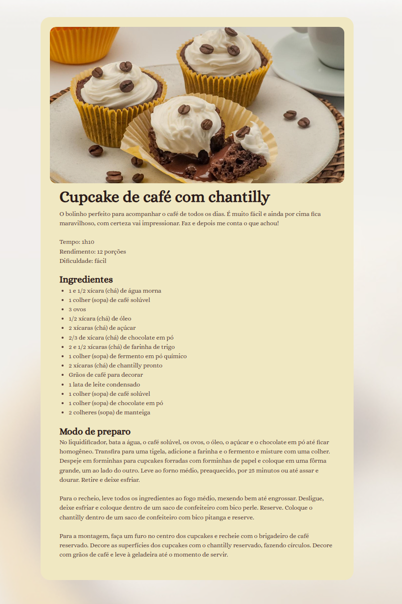

# 🍽️ Página de Receitas

Este é um projeto de uma página de receitas desenvolvido utilizando **HTML** e **CSS**.

## 📌 Funcionalidades
- Exibição de receitas culinárias
- Layout responsivo e estilizado
- Estrutura simples e fácil de modificar

## 🖼️ Captura de Tela



## 🚀 Tecnologias Utilizadas
- **HTML5**
- **CSS3**

## 📂 Como Utilizar
1. Clone este repositório:
   ```sh
   git clone https://github.com/nsbarros/pagina-receitas.git
   ```
2. Acesse a pasta do projeto:
   ```sh
   cd pagina-receitas
   ```
3. Abra o arquivo `index.html` no seu navegador.

## 📜 Licença
Este projeto está sob a licença MIT. Sinta-se à vontade para usá-lo e modificá-lo conforme necessário.

---
Feito com ❤️ por Nathan Barros (https://github.com/nsbarros)
